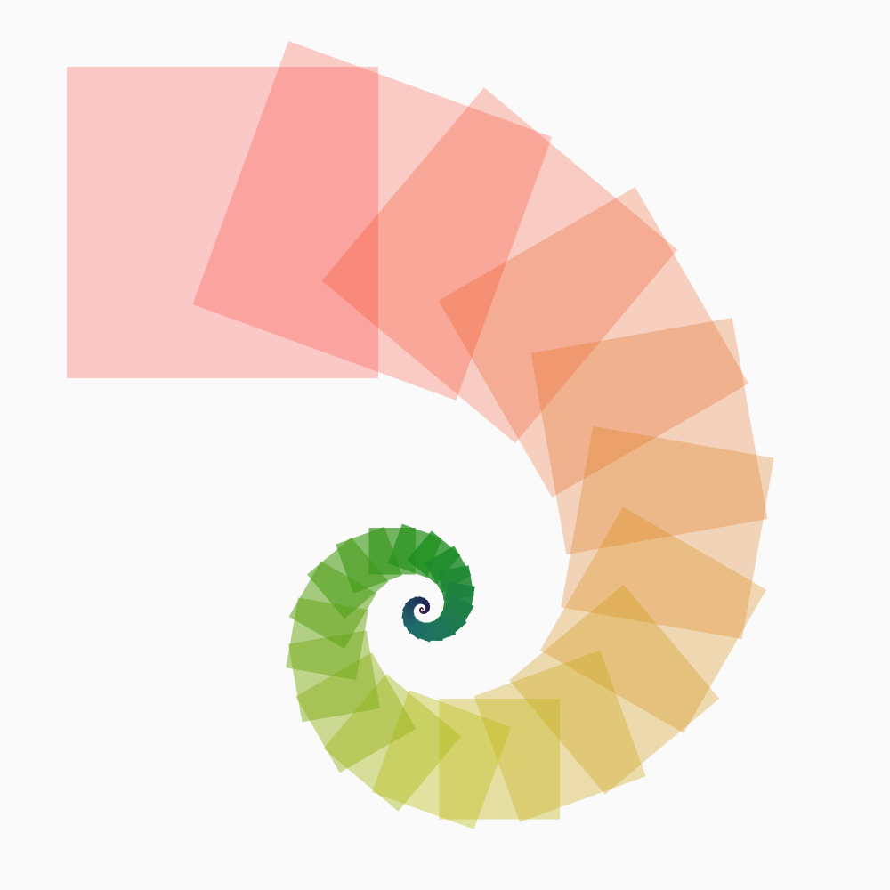
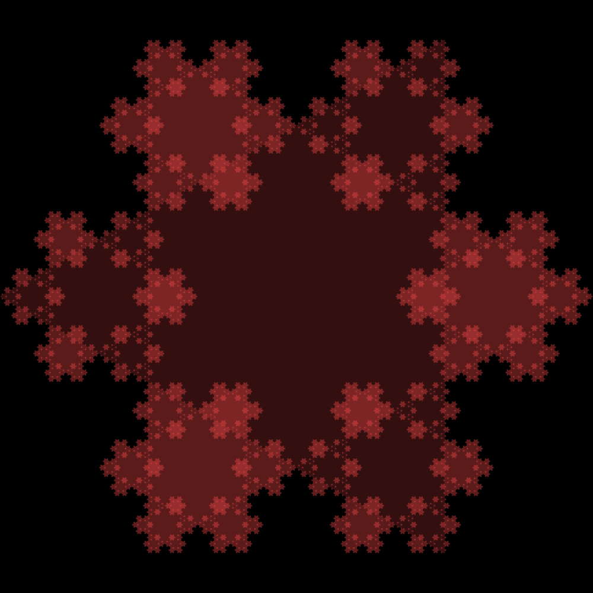
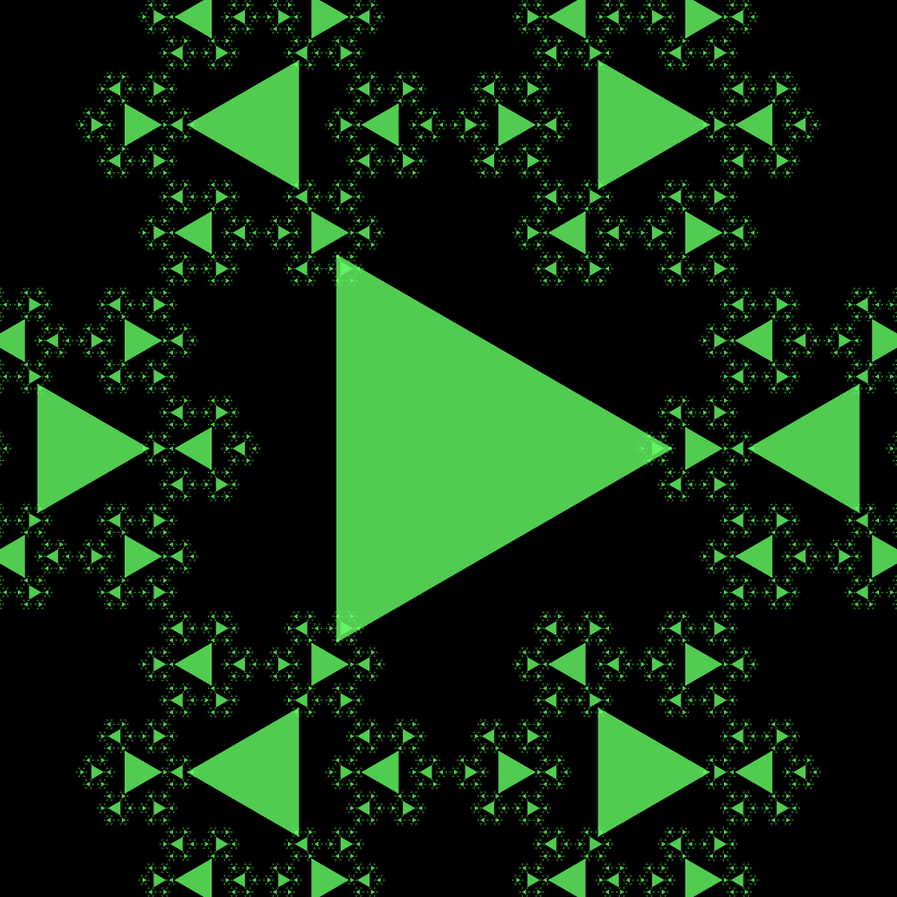

# Contextual

This is yet another rewriting of my software for drawing algorithmic
images based on a context-free grammar, eventually a nondeterministic
one.

This was inspired by the wonderful
[Context Free](http://www.contextfreeart.org/).  Over the course of
the past few years, I rewrote bits of Context Free in other languages
as practice (at least, that's what I tell myself in hindsight):

* Scala: https://github.com/Hodapp87/scala_cf3
* Clojure: https://github.com/Hodapp87/contextual_clojure
* JavaScript, HTML5, Canvas/SVG:
  https://github.com/Hodapp87/html5-dabbling/tree/master/contextual

I'd highly recommend not looking at the code for any of those, since
most of it's an ill-maintained mess and proof-of-concept.  I started
this version in late 2013 when I first started learning Haskell, so
the code is probably also atrocious at the moment.

The name *contextual* is something of a pun on Context Free.  It might
change later when I'm feeling more imaginative.

## Examples

These are all generated from `Test.hs`.

## TODOs & Wish-list for Contextual

### Core

* A way to specify canvas size.  Right now, non-square images will
throw off the aspect ratio - squares will be drawn as rectangles.
* Support for other primitives: circle, line, arc
* Some diagnostic information in `Context` such as the number of
primitives or average depth.
* Stopping rendering on grammars that don't converge (e.g. limiting
recursion depth or number of primitives)
* Support for separate stroke and fill, and perhaps thickness
* Bring the 'starting' color out of the backend-specific code
* Better colorspace than "plain" RGB.
[colour](https://hackage.haskell.org/package/colour) can probably help
here.  Alongside this: A saner way of specifying colors.
* Some optimization for the use of Cairo, e.g. if we are rendering a
big scene to a raster image, then doing it in layers of N primitives
may make sense to avoid building up huge scene graphs.

### Other Backends

* *Lighter SVG:* SVG export via
[blaze-svg](https://hackage.haskell.org/package/blaze-svg).  Cairo
exports SVG, but Cairo is a heavy dependency that may not be available
everywhere.
* *Web:* Some magic with [ghcjs](https://github.com/ghcjs/ghcjs) (looks like
[stack](http://docs.haskellstack.org/en/stable/ghcjs/) supports it) to
allow this to run in, and render in, the browser
([Canvas](https://github.com/ghcjs/ghcjs-base/tree/master/JavaScript/Web/Canvas)?
SVG? WebGL?)
* *GL:* OpenGL/WebGL rendering should be possible with the current
primitives.  Perhaps start at
[Beautiful Code](http://www.renci.org/wp-content/pub/tutorials/BeautifulCode.pdf).
* *IHaskell:* Integration with [IHaskell](https://github.com/gibiansky/IHaskell)
and [Jupyter](http://jupyter.org/).  Perhaps I can use the mechanism
that
[ihaskell-charts](https://hackage.haskell.org/package/ihaskell-charts)
uses, which looks like it ties in with
[Chart-cairo](https://hackage.haskell.org/package/Chart-cairo).

### General Tidiness/Refactoring

* Use namespaces already!
* Typeclass for backends?
* Perhaps factor out `Context` since much of it will be repeated in
other backends, particularly anything that does a more immediate-mode
drawing and lacks the `save`/`restore` of Cairo.
* Use of [Data.Reify](https://hackage.haskell.org/package/data-reify)
to transform recursive structures, perhaps to backends that can
express recursion natively or to a simplified expression
* Separate modules for separate backends (as many other libraries do)
* Perhaps rewriting using a simpler form of
[Free](https://hackage.haskell.org/package/free/docs/Control-Monad-Free.html)
that just uses the parts I need
* Am I using
[Comonad](https://gelisam.blogspot.co.uk/2013/07/comonads-are-neighbourhoods-not-objects.html)
implicitly?  Should I be using it explicitly?

### Possibly-farfetched

* Support for animation
* Extend support to 3D (same idea as in
  [Structure Synth](http://blog.hvidtfeldts.net/index.php/category/structure-synth/)
  from the amazing Syntopia blog).
