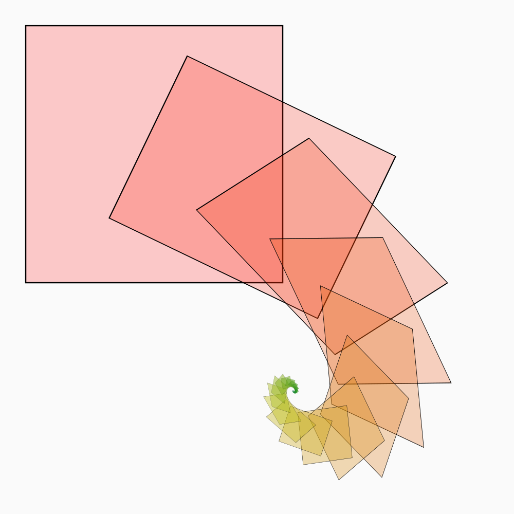

# Contextual

This is a Haskell library for drawing algorithmic images based on
context-free grammars.

This was inspired by the wonderful
[Context Free](http://www.contextfreeart.org/).  Over the course of
the past few years, I rewrote bits of Context Free in other languages
as practice (at least, that's what I tell myself in hindsight):

* Scala: https://github.com/Hodapp87/scala_cf3
* Clojure: https://github.com/Hodapp87/contextual_clojure
* JavaScript, HTML5, Canvas/SVG:
  https://github.com/Hodapp87/html5-dabbling/tree/master/contextual

I'd highly recommend not looking at the code for any of those, since
most of it's an ill-maintained mess and proof-of-concept.  I started
this version in late 2013 when I first started learning Haskell, but
in this rewrite I threw away nearly all of the code from that attempt.

The name *contextual* is something of a pun on Context Free.  It might
change later when I'm feeling more imaginative.

Right now, it has backends to render to Cairo and to
[blaze-svg](https://hackage.haskell.org/package/blaze-svg).  Some
minor differences are still being worked out, but for the most part
their outputs should be identical.  I am planning on some more
backends in the future.

## Examples

These are all generated from `Test.hs`.

## TODOs & Wish-list for Contextual

### Documentation

* Explain here how exactly Contextual works and how one might use it!
* Explain the examples!

### Core

* A way to specify canvas size.  Right now, non-square images will
throw off the aspect ratio - squares will be drawn as rectangles.
* Support for other primitives: circle, line, arc
* Some diagnostic information in `Context` such as the number of
primitives or average depth.
* Stopping rendering on grammars that don't converge (e.g. limiting
recursion depth or number of primitives)
* Support for stroke thickness (maybe)
* Some optimization for the use of Cairo, e.g. if we are rendering a
big scene to a raster image, then doing it in layers of N primitives
may make sense to avoid building up huge scene graphs.
* Randomness is deterministic - but contingent on recursion depth.
This prevents one from doing a more detailed render based on the same
random seed.  Is there a way around this?
([System.Random.split](https://hackage.haskell.org/package/random/docs/System-Random.html#v:split)
might be this.)
    * Done for blaze backend, but not yet for Cairo

### Other Backends

* *Web:* Some magic with [ghcjs](https://github.com/ghcjs/ghcjs)
(looks like [stack](http://docs.haskellstack.org/en/stable/ghcjs/)
supports it) to allow this to run in, and render in, the browser
([Canvas](https://github.com/ghcjs/ghcjs-base/tree/master/JavaScript/Web/Canvas)
as in [diagrams-canvas](https://github.com/diagrams/diagrams-canvas)?
SVG? WebGL?)
* *GL:* OpenGL/WebGL rendering should be possible with the current
primitives.  Perhaps start at
[Beautiful Code](http://www.renci.org/wp-content/pub/tutorials/BeautifulCode.pdf)
or [Gloss](https://hackage.haskell.org/package/gloss).
* *IHaskell:* Integration with [IHaskell](https://github.com/gibiansky/IHaskell)
and [Jupyter](http://jupyter.org/).  Perhaps I can use the mechanism
that
[ihaskell-charts](https://hackage.haskell.org/package/ihaskell-charts)
uses, which looks like it ties in with
[Chart-cairo](https://hackage.haskell.org/package/Chart-cairo).
* *PDF:* While Cairo can do this, I'd like properly color-managed
PDFs, and I don't think its PDF export will properly do this (as with
SVG).  PostScript is another option - see how
[diagrams-postscript](https://github.com/diagrams/diagrams-postscript)
does it perhaps.
* [Years ago](https://hodapple.com/blag/posts/2011-08-29-context-free.html),
I wrote, *"Translating something written in Context Free into another
programming language would in most cases not be difficult at all - you
need just a handful of 2D drawing primitives, a couple basic
operations for color space and geometry, the ability to recurse (and
to stop recursing when it’s pointless),"* but I never tested this idea
explicitly.  Considering I'm already plenty familiar with generating C
code from Haskell via my work with
[Ivory](http://ivorylang.org/ivory-introduction.html), this is not
especially farfetched.  Ivory or
[inline-c](https://hackage.haskell.org/package/inline-c) might be good
starting places - or [Fay](https://github.com/faylang/fay) or
[Haste](http://haste-lang.org/) perhaps, if I want to target
JavaScript.  However, this may not have much point without something
else to parametrize it over, e.g. a random seed or a time value in
order to animate.
* [Rasterific](https://github.com/Twinside/Rasterific)?

### General Tidiness/Refactoring

* Make a typeclass for rendering backends?
* Factor out the use of `Context` for rendering, since much of this
code seems to be repeated.  I'm not sure what form it will take, but
it should be possible to define a backend with fewer details, and let
the rendering function take care of what amount of context needs to be
passed around or managed (e.g. Cairo has state and `save`/`restore`
and Canvas (IIRC) is much the same, whereas with SVG one simply nests
transformations, and I'd imagine that OpenGL is more immediate-mode
and requires that we compose the transformations).
* Use of [Data.Reify](https://hackage.haskell.org/package/data-reify)
to transform recursive structures, perhaps to backends that can
express recursion natively or to a simplified expression
* Separate modules for separate backends (as many other libraries do)
* Perhaps rewriting using a simpler form of
[Free](https://hackage.haskell.org/package/free/docs/Control-Monad-Free.html)
that just uses the parts I need
* Am I using
[Comonad](https://gelisam.blogspot.co.uk/2013/07/comonads-are-neighbourhoods-not-objects.html)
implicitly?  Should I be using it explicitly?

### Possibly-farfetched

* Support for animation
* Extend support to 3D (same idea as in
[Structure Synth](http://blog.hvidtfeldts.net/index.php/category/structure-synth/)
from the amazing Syntopia blog).
